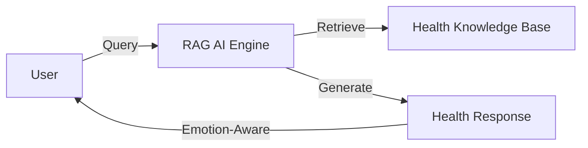

# 🩺 RAG-Powered AI Health Assistant


> Your personal AI companion for health insights, powered by Retrieval-Augmented Generation (RAG).

---

## ✨ Overview

The **RAG-Powered AI Health Assistant** is an intelligent system that combines **AI reasoning** with **retrieval-based knowledge** to provide personalized health guidance.  
It is designed to:

- Answer health-related queries accurately
- Provide references and explanations for its suggestions
- Detect and respond to emotional context in user interactions
- Ensure explainable AI decisions for trust and transparency

---

## 🧩 Features

- **RAG-Based Knowledge Retrieval**: Integrates large-scale health databases for accurate information.
- **Emotion-Aware Responses**: Understands user sentiment to tailor interactions.
- **Explainable AI**: Provides reasoning behind recommendations.
- **Multi-Modal Input Support**: Text and optional voice input for user convenience.
- **Continuous Learning**: Easily updatable knowledge base for latest medical insights.

---

## 🖥️ Demo


Try it locally:

```bash
git clone https://github.com/yourusername/rag-health-assistant.git
cd rag-health-assistant
pip install -r requirements.txt
uvicorn src.app:app --reload
````

Open your browser at [http://127.0.0.1:8000](http://127.0.0.1:8000) and start asking health-related questions!

---

## ⚙️ Architecture



**Components:**

1. **User Interface**: Accepts text/voice input.
2. **RAG AI Engine**: Combines retrieval & generative AI.
3. **Health Knowledge Base**: Medical articles, guidelines, and FAQs.
4. **Emotion Detection Module**: Adjusts response tone based on user sentiment.

---

## 📚 Tech Stack

| Layer      | Technology                                      |
| ---------- | ----------------------------------------------- |
| Backend    | Python, FastAPI, Uvicorn                        |
| AI & NLP   | HuggingFace Transformers, LangChain, RAG models |
| Database   | PostgreSQL / SQLite                             |
| Frontend   | ReactJS / Streamlit                             |
| Deployment | Docker, GitHub Actions                          |

---

## 🚀 Usage

1. **Clone the repository**
2. **Install dependencies**
3. **Run the app** with Uvicorn or Streamlit
4. **Ask health questions** and get AI-assisted, reference-backed answers!

---

## 📝 Contributing

Contributions are welcome!

* Fork the repo
* Create a new branch (`git checkout -b feature/YourFeature`)
* Commit your changes (`git commit -m 'Add feature'`)
* Push to the branch (`git push origin feature/YourFeature`)
* Open a Pull Request

---

## ⚖️ Disclaimer

This AI Health Assistant is **not a substitute for professional medical advice**. Always consult a licensed healthcare provider for medical concerns.

---

## 🔗 Links & Resources

* [Project Wiki](https://github.com/yourusername/rag-health-assistant/wiki)
* [Documentation](https://github.com/yourusername/rag-health-assistant/docs)
* [Issues](https://github.com/yourusername/rag-health-assistant/issues)

---

## 🌟 Stay Connected

[](https://linkedin.com/in/yourprofile)
[](https://twitter.com/yourprofile)
[](https://github.com/yourusername/rag-health-assistant/stargazers)

---

✨ Built with ❤️ for AI-powered health guidance


Do you want me to make that version too?
```
